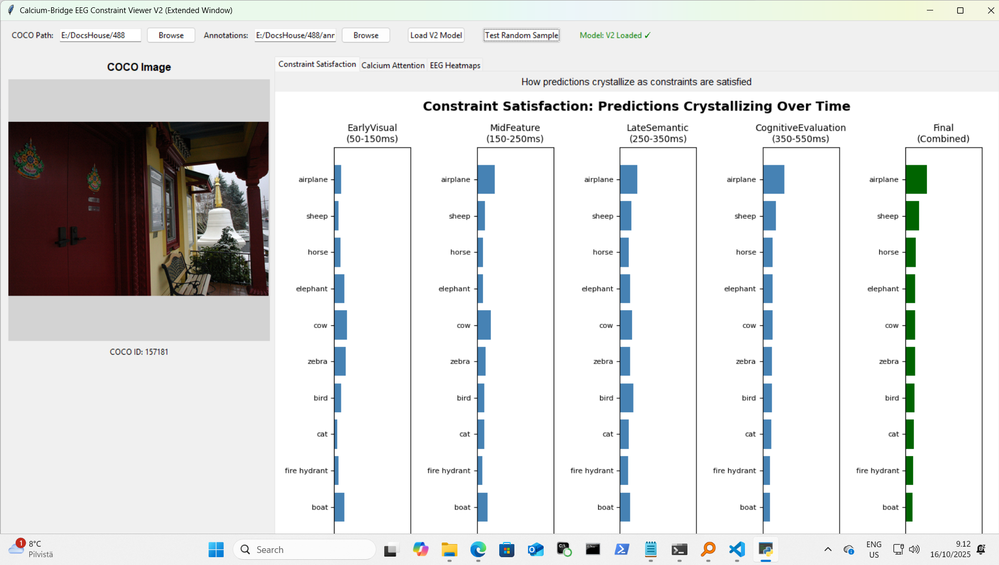

# Calcium-Bridged Temporal EEG Decoder (Vibe research) (Code / readme by Gemini)

This project explores the idea of decoding EEG brain signals by modeling perception as a sequential process. Instead of treating the brain's response as a single event, this system breaks it down into distinct temporal windows, attempting to model the "chain of thought" as a visual concept crystallizes in the mind.

The project consists of two main components:

A trainer (pkas_cal_trainer_gemini.py) that builds a novel neural network model using the Alljoined1 dataset.

A viewer (pkas_cal_viewer_gemini2.py) that loads the trained model and provides an interactive visualization of its "thought process" on new EEG samples.

(Example: The V2 Viewer showing the model's predictions for a 'train' image evolving over four time windows.)

# Core Concept: The "Vibecoded" System

The central idea of this project is a system inspired by neuromorphic computing and constraint satisfaction, which we've nicknamed the "vibecoded" system.

Here’s how it works simply:

Thinking in Moments: The brain's response to an image (e.g., from 0 to 600ms) is not analyzed all at once. It's sliced into four distinct "thinking moments" or time windows (e.g., 50-150ms, 150-250ms, etc.).

A Solver for Each Moment: Each time window is processed by a special "thinking module" (the CalciumAttentionModule). This module's job is to look at the EEG clues in its slice and find the best explanation that satisfies all the "constraints" in the signal.

The Calcium Bridge: This is the key. The "hunch" or "focus" from one thinking moment is passed to the next. For example, if the first module thinks the image is a "large animal," it passes that bias forward. The next module then uses this information to help it interpret its own clues, creating a causal chain of thought.

This allows the model to refine its predictions over time, moving from a general gist to a more specific concept, mimicking a plausible cognitive process.

# How It Works

Training (pkas_cal_trainer_gemini.py)

The trainer loads the Alljoined1 EEG dataset, which contains brainwave recordings from multiple people viewing thousands of images from the COCO dataset.

It trains a TemporalConstraintEEGModel, which is composed of four of the "vibecoded" modules in sequence.

During training, the model learns the common patterns of brain activity within each time window and, crucially, learns the statistical associations between concepts that are present in the collective human data.

The output is a single trained model file (e.g., calcium_bridge_eeg_model_v2.pth).

Visualization (pkas_cal_viewer_gemini2.py)

The viewer loads the .pth file generated by the trainer.

When you "Test Random Sample," it pulls a random EEG recording from the Alljoined1 test set and its corresponding COCO image.

It feeds the EEG data through the model and visualizes the output of each of the four internal thinking modules, showing how the final prediction "crystallizes" over time.

It also provides views of the raw EEG signals and the model's internal "Calcium" attention state.

# Requirements

Python 3.x
PyTorch
datasets (from Hugging Face)
tkinter (usually included with Python)
matplotlib
pillow
You can install the main dependencies with pip:

pip install torch datasets matplotlib pillow

# Setup and Usage

1. Data Setup

You need to download the COCO dataset images and annotations. The Alljoined1 EEG data will be downloaded automatically by the scripts.

COCO Images: Download the 2017 training/validation images from the COCO Dataset official site. You will need train2017.zip and/or val2017.zip. Unzip them into a known directory.

COCO Annotations: On the same site, download the "2017 Train/Val annotations". You only need the instances_train2017.json file.

# 2. Training the Model

(There is pre made model at: https://huggingface.co/Aluode/CalciumBridgeEEGConstraintViewer/tree/main)

Run the training script:

python pkas_cal_trainer_gemini.py

In the GUI that appears:

Click "Browse" to select the path to your COCO images folder (the folder containing train2017, etc.).

Click "Browse" to select your instances_train2017.json annotations file.

Adjust training parameters if desired (the defaults are reasonable).

Click "Train Extended Model (V2)".

Training will begin, and progress will be shown in the log window. A file named calcium_bridge_eeg_model_v2.pth will be saved periodically with the best-performing model.

# 3. Viewing the Results

Run the viewer script:

python pkas_cal_viewer_gemini2.py

In the GUI:

Select the same COCO image and annotation paths as you did for training.

Click "Load V2 Model" and select the calcium_bridge_eeg_model_v2.pth file you generated.

Once the model is loaded, click "Test Random Sample" to see the model's analysis of a new brain signal.

# A Note on Interpretation

This is an exploratory research tool. The model's predictions should not be interpreted as literal "mind-reading" of a specific person's thoughts.

Instead, the results reflect the complex statistical associations learned from the multi-subject Alljoined dataset. When the model associates a "horse trailer" with the concept of "horse," it is because this is a strong, common conceptual link found in the aggregate brain data it was trained on.

The viewer is a window into the "cognitive gestalt" of an "average mind" as represented by the dataset, visualizing how it might resolve perceptual ambiguity over a few hundred milliseconds.
